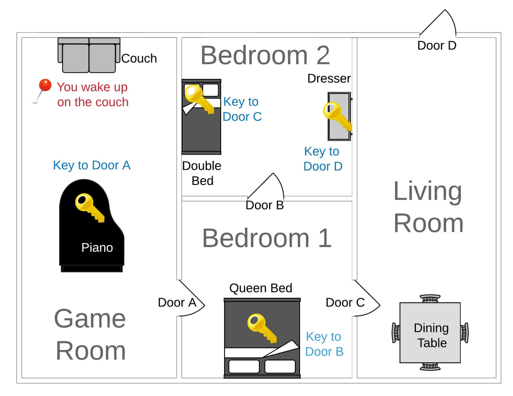

# Guided Project: Escape Room Python Game

## Overview

The goal of this project is for you to apply the Python programming skills you have learned this week in solving a real problem. We present you the design of a classic game that can be played via text - Escape Room. Your goal is to develop the game using Python based on the game design.

Read the game narratives and technical requirements carefully. Plan how you will achieve your goal with pseudo codes and/or flowchart. Review the logic and process in order to avoid potential errors. Then implement with Python code. After that, test your code several times with different inputs and make sure it's rock solid. The instructional team is standing by to help you in case you run into any problems.

---

## Game Design

### Game Map

### Game Narratives

#### Game Room

You wake up on a couch and find yourself in a strange house with no windows which you have never been to before. You don't remember why you are here and what had happened before. You feel some unknown danger is approaching and you must get out of the house, NOW!

You are now in game room.

What would you like to do?

You explore the room. This is Game Room. You find couch, piano, and Door A.

You examine couch. There isn't anything interesting about it.

You examine Door A. It is locked but you don't have the key.

You examine piano. You find key for Door A.

You examine Door A. Your unlock it with a key you have.

Do you want to go to the next room?

#### Bedroom 1

You are now in Bedroom 1.

What would you like to do?

You explore the room. This is Bedroom 1. You find queen bed, Door A, Door B, and Door C.

You examine queen bed. You find key for Door B.

You examine Door C. It is locked but you don't have the key.

You examine Door B. Your unlock it with a key you have.

Do you want to go to the next room?

#### Bedroom 2

You are now in Bedroom 2.

What would you like to do?

You explore the room. This is Bedroom 2. You find double bed, dresser, and Door B.

You examine double bed. You find key for Door C.

You examine dresser. You find key for Door D.

You examine Door B. Your unlock it with a key you have.

Do you want to go to the next room?

#### Bedroom 1

You are now in Bedroom 1.

What would you like to do?

You examine Door C. Your unlock it with a key you have.

Do you want to go to the next room?

#### Living Room

You are now in Living Room.

What would you like to do?

You explore the room. This is Living Room. You find dining table, Door C, and Door D.

You examine Door D. Your unlock it with a key you have.

Do you want to go to the next room?

#### Outside

Congrats! You escaped the room!

---

## Getting Started

Overwhelmed and don't know where to start? This is a touch challenge we know. But don't worry. We have included a working example for you to reference in which only 1 room (game room) is included. Read the example and make sure you understand it. Then you can expand on top of the example to code the rest of the rooms.

The provided example is just a Minimal Viable Product (MVP). It is fully functional but not bullet proof. You should be aware of its limitations while you are working and try to make your final product as robust as possible.

## Technical Requirements

* Use Python lists and dictionaries to define the rooms, items, and relations of them.

* Use a Python dictionary to store the game state. Update the state dictionary when progresses are made such as a key is collected.

* Use Python functions to play the game. Don't use procedural code.

* After completing each game action, call the next function to continue playing until the winning condition is reached.

* The winning condition is for the player to successfully make to the "Outside" room. When this happens, congrat the player and end the game.

## Necessary Deliverables

The following deliverables should be pushed to your Github repo.

* `main.ipynb` that contains your solution.
